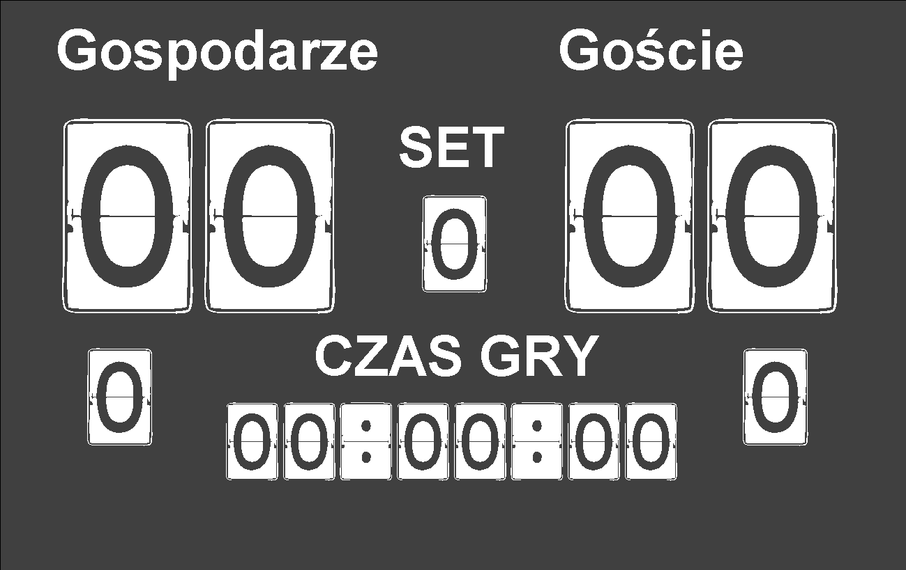

# Volleyball Scoreboard Server
Volleyball Scoreboard. A server application written in Java originally intended for Raspberry Pi
  

  
Client: <a href="https://github.com/xselthor/SVolleyballSportsBoardClient">Volleyball Scoreboard Client</a>
